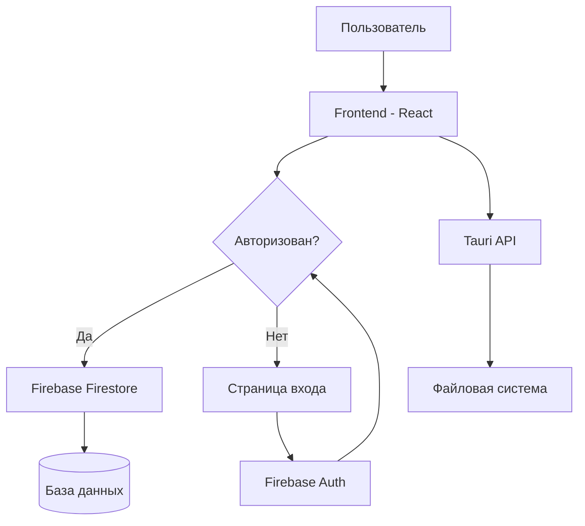
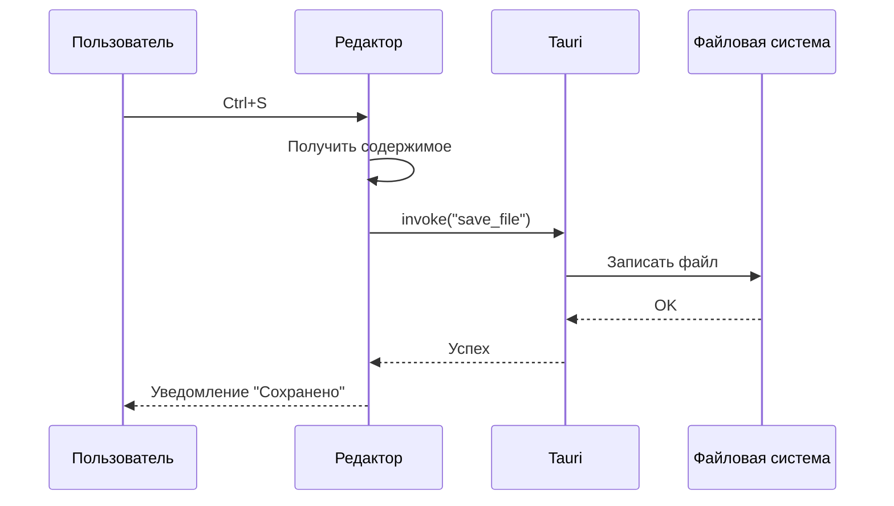
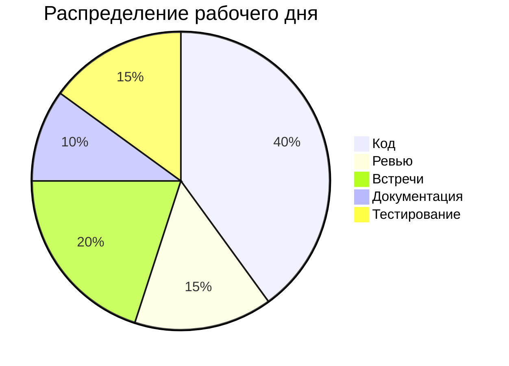
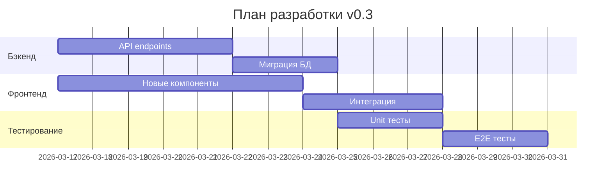
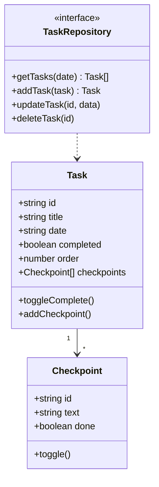
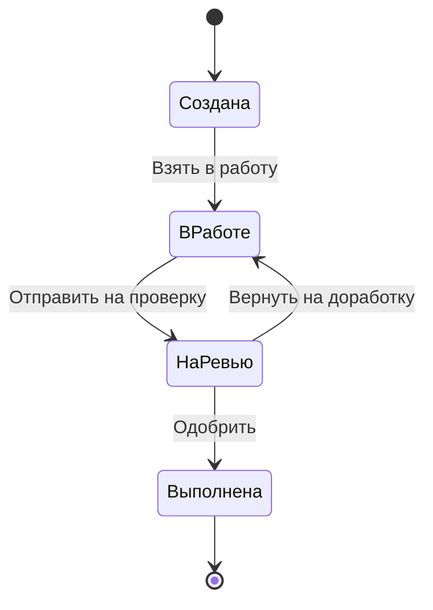

# Тестовый документ Mivra

Это тестовый документ для проверки рендеринга **жирного текста**, *курсива*, ~~зачёркнутого~~ и `inline code`. А также [ссылок](https://example.com).

## Списки

### Маркированный список
- Первый элемент
- Второй элемент
  - Вложенный элемент
  - Ещё один вложенный
- Третий элемент

### Нумерованный список
1. Шаг первый
2. Шаг второй
3. Шаг третий

## Цитата

> Простота — высшая степень утончённости.
> — Леонардо да Винчи

## Блок кода

```typescript
function greet(name: string): string {
  return `Привет, ${name}!`;
}

console.log(greet("Мир"));
```

---

## Таблицы

### Сравнение фреймворков

| Фреймворк | Язык       | Звёзды GitHub | Год выпуска |
|-----------|------------|---------------|-------------|
| React     | JavaScript | 225k          | 2013        |
| Vue       | JavaScript | 208k          | 2014        |
| Angular   | TypeScript | 96k           | 2016        |
| Svelte    | JavaScript | 80k           | 2016        |
| SolidJS   | TypeScript | 33k           | 2021        |

### Статус задач

| ID  | Задача                     | Приоритет | Статус      |
|-----|---------------------------|-----------|-------------|
| 001 | Настройка CI/CD           | Высокий   | Выполнено   |
| 002 | Рефакторинг авторизации   | Средний   | В работе    |
| 003 | Оптимизация запросов к БД | Высокий   | Ожидание    |
| 004 | Написание документации    | Низкий    | Не начато   |

---

## Диаграммы Mermaid

### Flowchart — архитектура приложения



### Sequence — процесс сохранения файла



### Pie — распределение времени



### Gantt — план проекта



### Class diagram — структура данных



### State diagram — жизненный цикл задачи


